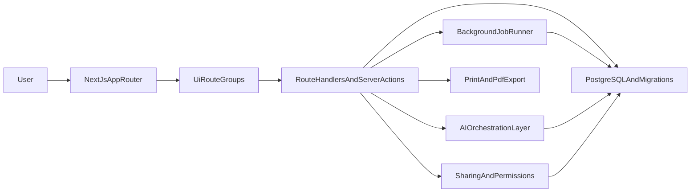

# AetherForge Project Plan (Current App)

## Goal

Build the current AetherForge app from its existing baseline into an MVP that supports:

- Topic onboarding and guided learning objectives.
- AI-generated concept exploration and examples.
- Quiz practice and actionable feedback.
- Spaced-repetition flashcards.
- Learning plans, progress tracking, and notes workspace.
- Printable exports and role-based collaboration.

## Current Baseline

Current repository state:

- `src/app/(marketing)` and `src/app/(app)` route groups are in place with authenticated workspace navigation.
- Session auth, protected routes, and DB-backed workspace membership flows are implemented.
- Onboarding now supports persisted topic, difficulty, and learning goals via `GET/PATCH /api/workspace`.
- Concept generation/artifact lineage, quiz attempt/review/compare, and flashcard SRS queue/review APIs are implemented.
- Plan milestones, progress timeline, resources CRUD/filtering, study-packet export, collaboration invites/roles, and internal reliability endpoints are available.
- `src/app/globals.css` provides shared workspace styling, and `package.json` includes the scripts needed for migrations, jobs, health checks, linting, and build.

This means AetherForge is now a functional MVP-in-progress with most core workflows implemented, and remaining work is focused on integration depth, quality hardening, and release readiness.

## Product Scope

### In Scope (MVP)

- Single-topic learning experience per workspace.
- Difficulty-aware content generation.
- Concept tree plus concept detail pages with examples/case studies.
- Quiz generation, attempts, scoring, and feedback.
- Flashcard generation and spaced repetition review queue.
- Learning plans, progress timeline, and lightweight notes/resources.
- Printable export for concept summaries, quizzes, flashcards, and plans.
- Sharing and collaboration with owner/editor/viewer roles.

### Out of Scope (MVP)

- Multi-topic cross-workspace analytics and recommendations.
- Native mobile apps.
- Real-time co-editing with operational transforms/CRDT.
- Enterprise SSO and advanced compliance controls.
- Marketplace/plugin ecosystem.

## Delivery Strategy

- Build vertically by user journey while keeping shared contracts stable.
- Lock schemas early for generated content artifacts to reduce churn.
- Prefer server-side writes via route handlers/server actions to keep security boundaries simple.
- Add observability and testing in each phase, not as a last-step add-on.

## Target Architecture

### Incremental Build Order

Build has progressed substantially; this sequence is now the delivery lineage and remaining integration-hardening order:

1. Foundation route skeletons and shared domain contracts (completed).
2. Auth and persistence layer (completed).
3. AI orchestration and generation contracts (completed baseline).
4. Practice loops (quiz + flashcards + scheduling) (active hardening/expansion).
5. Planning/resources workflows (active hardening/expansion).
6. Export/collaboration (active hardening/expansion).
7. Reliability and release hardening (active).

## Planned Project Structure (Repository-Aligned)

- `src/app/` - App Router entrypoints and route groups.
- `src/app/(marketing)/` - Landing and public pages.
- `src/app/(app)/onboarding/` - Topic, difficulty, goals setup.
- `src/app/(app)/learn/` - Concept explorer and concept details.
- `src/app/(app)/quiz/` - Quiz generation, attempts, and results.
- `src/app/(app)/flashcards/` - Decks and review sessions.
- `src/app/(app)/plan/` - Learning plan and progress dashboards.
- `src/app/(app)/resources/` - Notes, highlights, and references.
- `src/app/api/` - API route handlers (generation, progress, sharing, export).
- `src/components/` - Reusable UI components.
- `src/lib/ai/` - Prompt templates, schema validators, provider adapters.
- `src/lib/db/` - DB client, query modules, migration helpers.
- `src/lib/srs/` - Spaced-repetition scheduling logic.
- `src/lib/export/` - Print templates and render pipeline.
- `src/lib/collab/` - Permissions, invites, comments, and version checks.
- `src/lib/observability/` - Logging, metrics, tracing integration points.

## Phase Plan (Execution Roadmap)

### Status Snapshot (Updated)

- Overall: core MVP workflows are implemented end-to-end in baseline form; current work is focused on depth, reliability, and release readiness.
- Phase 0: complete.
- Phase 1: complete (auth/session guardrails, DB schema+migrations+seed pipeline, DB-backed workspace access by signed-in user, persisted onboarding topic/difficulty/learning goals flow, and protected app routes including export/collaboration surfaces).
- Phase 2: complete (provider-backed concept generation path with strict validation, artifact lineage persistence, and explorer/detail + artifact graph/reload flows).
- Phase 3: in progress (quiz generation from concepts, attempt start/submit scoring flow, concept-linked weak-area feedback, attempt trend visibility with timeframe query support, deep-linkable question-by-question review pages, attempt comparison analytics across workspace and per-attempt views, and targeted retry quiz generation from weak concepts).
- Phase 4: in progress (flashcard generation from quiz misses, SM-2-style scheduler utility, due-queue API, review scoring endpoint, flashcards workspace UI replacing placeholder page, an internal idempotent queue-refresh job endpoint for scheduled top-ups, and a cron-friendly job runner script).
- Phase 5: in progress (plan title persistence, milestone create/edit/complete/delete workflow, progress snapshot widgets, progress-event timeline updates with readable labels, category filters, and pagination, resources API, and resources workspace UI replacing placeholder pages with note/tag capture, filterable search, quick tag chips, and inline edit/delete controls).
- Phase 6: in progress (browser print-first study packet export route with section toggles, answer-key/compact options, A4/Letter page-size controls, improved print-fidelity CSS, and in-app export preview workspace).
- Collaboration track: in progress (owner-scoped member management, pending invite-token generation + acceptance flow, role transitions between editor/viewer, revoke flow with invite invalidation, audit event persistence for member/invite changes, and collaboration workspace UI scaffold).
- Phase 7: in progress (internal health endpoint with queue/job diagnostics, internal job run ledger persistence, and baseline reliability runbook).

### Phase 0 - Foundation Establishment (Completed)

**Deliverables**

- Standard route group skeleton under `src/app/(marketing)` and `src/app/(app)`.
- Shared TypeScript domain types and DTO contracts.
- Environment variable strategy and runtime validation scaffold.
- Basic app shell navigation placeholders for future features.

**Dependencies**

- Existing Next.js scaffold only.

**Exit Criteria**

- App builds with route groups in place.
- Shared types are consumed by at least one route and one API handler scaffold.
- Local env bootstraps consistently across machines.

**Demo Checklist**

- Navigate from landing to authenticated app shell placeholder.
- Show typed contract reuse between UI and backend layer.

### Phase 1 - Auth and Data Foundation (Completed)

**Deliverables**

- Authentication flow (sign in/out and protected app routes).
- Initial PostgreSQL schema: users, workspace, concepts, quizzes, flashcards, plans, resources, progress.
- Migration pipeline and seed strategy.
- Repository query helpers for core entities.

**Dependencies**

- Phase 0 route and contract baseline.

**Exit Criteria**

- User can sign in and access only their own workspace data.
- Core entities can be created/read in dev and test environments.

**Demo Checklist**

- Complete login and create initial workspace profile.
- Verify data isolation between two test accounts.

### Phase 2 - Concept Generation and Explorer (Completed Baseline)

**Deliverables**

- AI concept graph generation endpoint with strict schema validation.
- Concept explorer UI with drill-down to concept detail pages.
- Generated examples/case studies linked to concept nodes.
- Artifact versioning and provenance metadata persistence.

**Dependencies**

- Auth and database entities from Phase 1.

**Exit Criteria**

- User can generate a concept graph for selected topic and difficulty.
- Saved generation artifacts can be reloaded without regeneration.

**Demo Checklist**

- Generate and browse concept graph in one session.
- Reload app and view persisted concept graph and examples.

### Phase 3 - Quiz and Feedback Loop (In Progress: Hardening and Expansion)

**Deliverables**

- Quiz generation from concept graph with mixed question types.
- Quiz attempt lifecycle (start, answer, submit, score).
- Feedback page with weak-area suggestions and next actions.
- History of attempts and trend indicators.

**Dependencies**

- Concept artifacts and user progress model.

**Exit Criteria**

- User completes a full quiz attempt and receives actionable feedback.
- Quiz history is queryable by workspace and timeframe.

**Demo Checklist**

- Run a quiz and inspect question-by-question evaluation.
- Display trend from multiple attempts.

### Phase 4 - Flashcards and Spaced Repetition (In Progress: Hardening and Expansion)

**Deliverables**

- Flashcard generation from concepts and quiz misses.
- Scheduling engine for daily review queue.
- Review session UI with recall scoring and interval updates.
- Background job for queue refresh and overdue handling.

**Dependencies**

- Quiz performance signals from Phase 3.

**Exit Criteria**

- User has a daily review queue that changes based on recall scores.
- Scheduler updates are idempotent and traceable.

**Demo Checklist**

- Generate flashcards from weak concepts.
- Complete review session and show updated next-review dates.

### Phase 5 - Plans, Progress, and Resources (In Progress: Hardening and Expansion)

**Deliverables**

- Learning plan editor with milestones and deadlines.
- Progress dashboard combining concept, quiz, and flashcard activity.
- Notes/highlights/summaries workspace with tagging.
- Resource link metadata storage and retrieval.

**Dependencies**

- Stable concept/quiz/flashcard data flow from Phases 2-4.

**Exit Criteria**

- User can maintain a plan and see progress updates from completed activities.
- Notes/resources remain persisted and searchable per workspace.

**Demo Checklist**

- Create a plan and complete one milestone-linked learning activity.
- Add notes and retrieve them by tag.

### Phase 6 - Export and Collaboration (In Progress: Hardening and Expansion)

**Deliverables**

- Printable templates for concept summaries, quizzes, flashcards, and plan pages.
- Export flow (print view first, PDF optional).
- Sharing model with `owner`, `editor`, `viewer` roles.
- Invite and revoke flows plus comments on shared assets.
- Version-check strategy to avoid silent overwrite.

**Dependencies**

- Data completeness from previous phases.

**Exit Criteria**

- User exports selected materials with readable A4/Letter layouts.
- Shared asset permissions are enforced correctly across roles.

**Demo Checklist**

- Export a study packet with optional answer key.
- Share with another account, test editor/viewer boundaries.

### Phase 7 - Reliability and Pilot Readiness (In Progress)

**Deliverables**

- Metrics, tracing, and error monitoring hooks.
- Retries/fallbacks for AI provider failures.
- AI output quality checks and schema failure alerts.
- Pilot release checklist and operational runbook.

**Dependencies**

- All feature paths integrated end-to-end.

**Exit Criteria**

- MVP meets release gates (below) in staging.
- End-to-end user journey passes regression suite.

**Demo Checklist**

- Show dashboard for request latency, generation failures, and queue health.
- Run full onboarding-to-review flow in candidate build.

## Permission Model (MVP)

- `owner`: full control including sharing, revocation, and deletion.
- `editor`: can modify content, comment, and export.
- `viewer`: read-only; comments optional per share policy.
- Default share role is least privilege (`viewer`).
- Role changes and revocations are audited.
- Access revocation invalidates active invite tokens immediately.

## Export Specification (MVP)

- Output modes: browser print (required), PDF export (optional).
- Page sizes: A4 and Letter.
- Templates: concept summary, quiz booklet, flashcard sheet, plan tracker.
- Controls: include/exclude sections, compact/detailed mode, answer key toggle.
- Print quality constraints: grayscale-safe contrast, no clipping at standard margins.
- Mandatory provenance line on exported content.

## Risk Register

- AI output variability may break downstream rendering or grading assumptions.
- Generation latency may degrade UX during multi-step content creation.
- Data schema churn can slow delivery if contracts are not stabilized early.
- Collaboration conflicts may create accidental data loss without version checks.
- Export rendering differences across browsers may impact print fidelity.

## Testing Strategy

### Unit

- SRS interval calculations and queue scoring.
- Permission evaluation helpers.
- Prompt response normalization and schema parsing.

### Integration

- Generation pipeline from request to persisted artifacts.
- Quiz submission and feedback persistence.
- Sharing and revocation behavior across roles.
- Export assembly for selected modules.

### End-to-End

- Full user loop: onboarding -> concepts -> quiz -> feedback -> flashcards -> progress.
- Share-and-collaborate path with two users.
- Export-and-print path with multiple template combinations.

## Release Gates (MVP)

- Performance: typical page transitions under 2s in staging baseline.
- Reliability: no critical-severity blocker in core user loop.
- Security/privacy: user data isolation verified in access tests.
- AI quality: schema-valid generation success rate meets internal threshold.
- Usability: phase demos complete without manual DB intervention.

## Definition of Done

- Current scaffold evolves into a functional MVP across all scoped flows.
- Phases are implemented in dependency order with exit criteria met.
- Architecture and structure remain aligned to `src/app` repository layout.
- Release gates are met and pilot launch checklist is complete.
